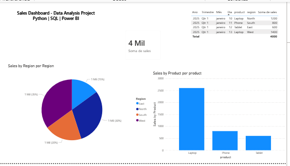

# Sales Data Analytics Pipeline

Project for analyzing sales data using Python, SQL and Power BI.

## Technologies
- Python
- SQL
- Power BI
- Pandas
## Dataset

The dataset contains sales information including:

- Date
- Product
- Region
- Sales value

The data is used to perform aggregation and visualization in the dashboard.
## Features
- Sales data analysis
- Aggregation by region
- Dashboard visualization
- ## Dashboard

